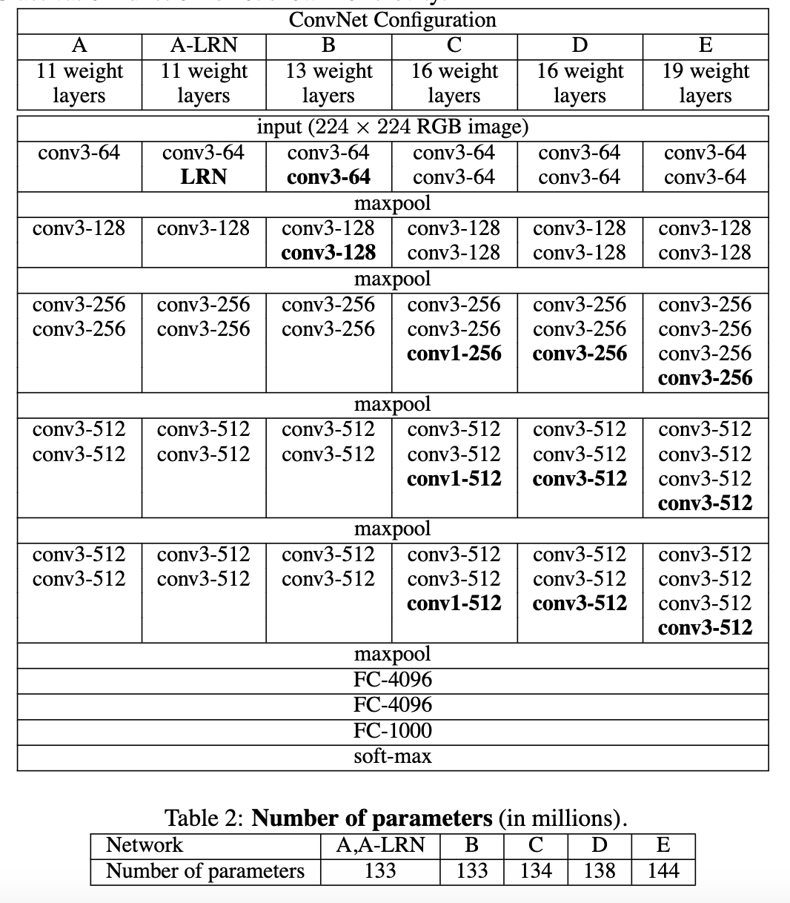

## Session Overview

During this paper discussion session, we will cover the following topics:

- The motivation behind the VGG architecture
- The architecture and its components
- The impact of the VGG architecture on the field of computer vision

### The motivation behind the VGG architecture

The VGG paper was motivated by the need for a deeper and more expressive neural network architecture for image classification. The authors of the paper wanted to investigate whether increasing the depth of a neural network would improve its performance on the ImageNet classification task.

### The architecture and its components

The VGG architecture is a deep convolutional neural network that consists of 16 or 19 layers, depending on the variant used. The architecture is characterized by its use of small (3x3) convolutional filters and max pooling layers. The VGG architecture also uses a fully connected layer at the end of the network for classification.

During the paper discussion session, we will go over the architecture in detail, including its various layers and components.

### The impact of the VGG architecture on the field of computer vision

The VGG architecture had a significant impact on the field of computer vision, both in terms of its performance on the ImageNet classification task and its influence on subsequent research. The VGG architecture achieved state-of-the-art results on the ImageNet task in 2014, and its success inspired further research into deeper and more complex neural network architectures.

During the paper discussion session, we will explore the impact of the VGG architecture on the field of computer vision and discuss its lasting legacy.

